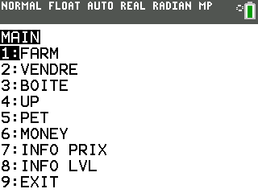
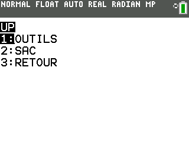
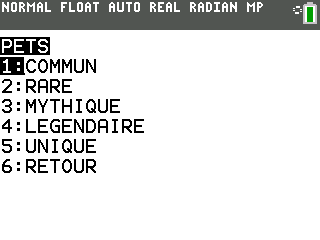

# SmsIdle
## Principe du Jeu

Le jeu consiste en un IDLE classique où l'on peut récupérer de l'argent, le vendre et améliorer ses outils

## Fonctionnalités proposées
### Menu principale

Le jeu propose 8 fonctionnalité

- Farm, qui permet d'obtenir des blocs
- Vendre, qui permet de vendre les blocs farms
- Boite, qui permet de récuperer des pets
- Upgrade, qui permet d'améliorer les deux outils du jeu
- Pets, le menu permettant d'utiliser les pets obtenues
- Money, qui permet de voir l'argent actuelle
- Info prix, donne le prix des boites et des améliorations
- Info lvl, permet de voir le niveau des outils

### Farm

Fonction du jeu permettant d'obtenir des blocs qui sont en suite stocker dans le sac, la taille du sac, le nombre de bloc et le temps d'attente dans la récupération des blocs dépendent du niveau des outils

### Vendre

Permet de vider le sac en vendant les blocs stocker et permet de récupérer de l'argent utile pour acheter des améliorations ou des familliers aidant a avancé dans le jeu

### Boite

Fonction permettant d'acheter des familliers utile a l'avancer du jeu, le prix augmente au fure et a mesure des achats

### Améliorations

Le menu d'amélioration permet d'acheter des améliorations pour les outils du jeu

- Le niveau de la pioche plafonne a 15 ( Cherchez ce qui se passe quand vous le monter a 20 ;) )

- Le niveau du sac plafonne quand a lui a 8

### Les familliers

Il existe 5 rareté de familliers allant de Commun a Unique avec 10 familliers différents, la rareté du famillier fait dépendre son utilité

### Le reste

- Money permet de voir l'argent détenu par le joueur
- Info prix permet de voir le prix des différentes améilorations ainsi que le prix des boites
- Info lvl permet de voir le niveau actuelle des outils

## Installation

Le jeu s'installe grâce au logiciel ti connect ce, il est utilisable sur ti 83 premium ce ainsi que sur ti 84 plus ce

## Collaboration

Toute modification du programme dans le but d'améliorer le fonctionnement du jeu est la bienvenue

## Remerciement spéciale

Remerciement a Tristan_G7 et Bomb_hermann666 qui m'ont aidé a trouvé le nom du jeu et qui m'ont servi de testeur
